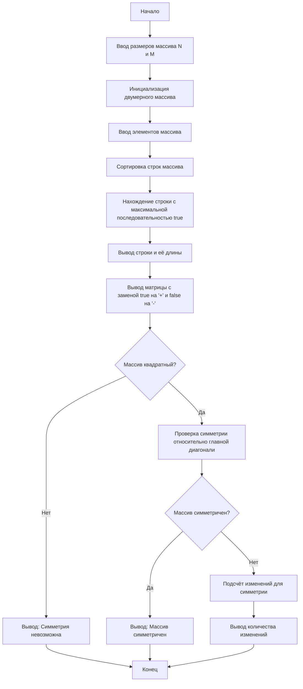

# Lab-2
## Отчет по лабораторной работе № 2

#### № группы: `ПМ-2402`

#### Выполнил: `Киблицкий Ян Денисович`

#### Вариант: `11`

### Cодержание:

- [Постановка задачи](#1-постановка-задачи)
- [Входные и выходные данные](#2-входные-и-выходные-данные)
- [Выбор структуры данных](#3-выбор-структуры-данных)
- [Алгоритм](#4-алгоритм)
- [Программа](#5-программа)
- [Анализ правильности решения](#6-анализ-правильности-решения)

### 1. Постановка задачи
## Задачи

1. Считать с консоли размеры массива N и M, а затем элементы массива размером N × M (значения true или false).
2. Сортировать строки массива по возрастанию количества значений `true` в каждой строке. При равенстве количества сортировать строки по количеству последовательных значений `true`.
3. Найти и вывести строку с максимальным количеством последовательных значений `true`, а также длину этой последовательности.
4. Вывести элементы массива в виде матрицы, заменяя `true` на символ `+` и `false` на символ `-`. Дополнительно подсчитать количество "островков" (групп соседних значений `true` в каждой строке).
5. Проверить симметричность массива относительно главной диагонали. Если массив несимметричен, определить минимальное количество изменений для достижения симметрии.

### 2. Входные и выходные данные

#### Данные на вход

На вход программа должна получать 2 числа, при этом в условии не сказано, к какому множеству
принадлежать получаемые числа, поэтому будем считать их вещественными положительными (тк это стороны матрицы, а проверка на некорректные значения не требуется). 
Также даны верхняя и нижняя границы получаемых чисел.

| Параметр      | Тип                | min значение    | max значение   |
|---------------|--------------------|-----------------|----------------|
| `M` (Число 1) | Вещественное число |        >0       | 10<sup>9</sup> |
| `N` (Число 2) | Вещественное число |        >0       | 10<sup>9</sup> |

Так же программа получает матрицу M x N типа boolean.

| Параметр        | Тип      |
|-----------------|----------|
| Элемент матрицы | Boolean  |


#### Данные на выход

1. Отсортированный массив
| Параметр            | Тип данных  |
|---------------------|-------------|
| Элементы массива    | boolean     |

2. Строка с максимальной последовательностью true
| Параметр                      | Тип данных     | Минимальное значение | Максимальное значение |
|-------------------------------|----------------|-----------------------|----------------------|
| Элемент строки                | boolean        | -                     | -                    |
| Длина последовательности      | int            | 0                     | M                    |

3. Матрица с заменой true/false на символы
| Параметр            | Тип данных | Минимальное значение | Максимальное значение |
|---------------------|------------|-----------------------|-----------------------|
| Символьная матрица  | char       | '-'                   | '+'                   |


4. Симметрия относительно главной диагонали
| Параметр                                       | Тип данных | Минимальное значение | Максимальное значение |
|------------------------------------------------|------------|----------------------|-----------------------|
| Симметрия массива                              | boolean    | -                    | -                     |
| Минимальное количество изменений для симметрии | int        | 0                    | (`N` × `M`)/2         |


### 3. Выбор структуры данных

Программа получает 2 вещественных числа, не превышающих по модулю 10<sup>9</sup> . Поэтому для их хранения
можно выделить 2 переменных (`M` и `N`) типа `int`.

|             | название переменной | Тип (в Java) | 
|-------------|---------------------|--------------|
| X (Число 1) | `M`                 | `int`        |
| Y (Число 2) | `N`                 | `int`        | 

Для вывода результата необязательно его хранить в отдельной переменной.

### 4. Алгоритм

#### Алгоритм выполнения программы:

### 1. **Ввод данных**

1. Программа запрашивает у пользователя размеры двумерного массива (N - количество строк, M - количество столбцов).
2. Программа инициализирует двумерный массив булевых значений размером N × M.
3. Программа запрашивает у пользователя ввод значений для каждого элемента массива, где каждый элемент должен быть либо `true`, либо `false`.

### 2. **Сортировка строк массива**

1. Программа сортирует строки двумерного массива:
   - Сначала строки сортируются по количеству значений `true` в каждой строке.
   - Если количество значений `true` в строках одинаково, строки сортируются по максимальной длине последовательных значений `true` в каждой строке.

### 3. **Нахождение строки с максимальной длиной последовательных `true`**

1. Программа перебирает строки массива и вычисляет для каждой строки длину максимальной последовательности `true`.
2. Программа запоминает строку с максимальной длиной последовательности `true` и выводит её вместе с длиной этой последовательности.

### 4. **Вывод матрицы**

1. Программа выводит матрицу, заменяя элементы `true` на символ `+`, а элементы `false` на символ `-`.

### 5. **Проверка симметрии массива относительно главной диагонали**

1. Программа проверяет, является ли массив симметричным относительно главной диагонали (матрица должна быть квадратной для проверки симметрии).
   - Если массив квадратный, проверяется, равны ли элементы на позиции [i][j] и [j][i].
   - Если элементы не равны, программа выводит минимальное количество изменений для достижения симметрии.

#### Блок-схема



### 5. Программа

```java
import java.util.*;

public class Main {
    public static void main(String[] args) {
        Scanner scanner = new Scanner(System.in);

        // Запрашиваем размеры массива у пользователя
        System.out.println("Введите размеры массива (N M):");
        int n = scanner.nextInt(); // Количество строк
        int m = scanner.nextInt(); // Количество столбцов

        // Инициализируем двумерный массив boolean
        boolean[][] array = new boolean[n][m];

        // Пользователь вводит элементы массива (true/false)
        System.out.println("Введите элементы массива (true/false):");
        for (int i = 0; i < n; i++) {
            for (int j = 0; j < m; j++) {
                array[i][j] = scanner.nextBoolean();
            }
        }

        // 1. Сортировка строк массива:
        // Сортируем строки по количеству значений true, затем по максимальной длине последовательных true
        Arrays.sort(array, Comparator.comparingInt((boolean[] row) -> countTrue(row))
                .thenComparing((boolean[] row) -> maxTrue(row)));

        // 2. Нахождение строки с максимальным количеством последовательных true
        int maxRowIndex = 0; // Индекс строки с максимальной последовательностью
        int maxLength = 0;   // Длина этой последовательности
        for (int i = 0; i < n; i++) {
            int length = maxTrue(array[i]);
            if (length > maxLength) {
                maxLength = length;
                maxRowIndex = i;
            }
        }
        // Выводим результат
        System.out.println("\nСтрока с максимальным количеством последовательных значений true:");
        System.out.println(Arrays.toString(array[maxRowIndex]) + " Длина: " + maxLength);

        // 3. Вывод матрицы с заменой true на '+' и false на '-'
        System.out.println("Матрица после сортировки:");
        printMatrix(array);

        // 4. Проверка симметрии относительно главной диагонали
        if (n != m) { // Если массив не квадратный, проверка невозможна
            System.out.println("Массив не квадратный, симметрия невозможна.");
        } else {
            if (isSymmetric(array)) {
                System.out.println("Массив симметричен относительно главной диагонали.");
            } else {
                // Вычисляем минимальное количество изменений для симметрии
                int changes = minChangesToSymmetric(array);
                System.out.println("Массив несимметричен. Минимальное количество изменений: " + changes);
            }
        }
    }

    // Подсчет количества значений true в строке
    private static int countTrue(boolean[] row) {
        int count = 0;
        for (boolean value : row) {
            if (value) count++;
        }
        return count;
    }

    // Нахождение максимальной длины последовательных значений true в строке
    private static int maxTrue(boolean[] row) {
        int max = 0, current = 0;
        for (boolean value : row) {
            if (value) {
                current++; // Увеличиваем текущую последовательность
                max = Math.max(max, current); // Обновляем максимум
            } else {
                current = 0; // Сбрасываем последовательность
            }
        }
        return max;
    }

    // Вывод массива с заменой true на '+' и false на '-'
    private static void printMatrix(boolean[][] array) {
        for (boolean[] row : array) {
            for (boolean value : row) {
                System.out.print(value ? "+" : "-"); // Заменяем true и false
            }
            System.out.println();
        }
    }

    // Проверка симметрии относительно главной диагонали
    private static boolean isSymmetric(boolean[][] array) {
        int n = array.length;
        for (int i = 0; i < n; i++) {
            for (int j = 0; j < n; j++) {
                if (array[i][j] != array[j][i]) return false; // Если хоть один элемент не совпадает, массив несимметричен
            }
        }
        return true;
    }

    // Подсчет минимального числа изменений для симметрии
    private static int minChangesToSymmetric(boolean[][] array) {
        int n = array.length;
        int changes = 0;

        // Проверяем только верхний треугольник матрицы
        for (int i = 0; i < n; i++) {
            for (int j = i + 1; j < n; j++) { // j > i
                if (array[i][j] != array[j][i]) changes++; // Считаем количество несовпадений
            }
        }
        return changes;
    }
}
```

### 6. Анализ правильности решения

Программа работает корректно на всем множестве решений с учетом ограничений.

1. Тест на `X > Y > 0`:

    - **Input**:
        ```
        5 1.3
        ```

    - **Output**:
        ```
        5
        ```

2. Тест на `X < Y < 0`:

    - **Input**:
        ```
        -4 -2.2
        ```

    - **Output**:
        ```
        2.2
        ```

3. Тест на `X < 0 < Y`:

    - **Input**:
        ```
        -4 5
        ```

    - **Output**:
        ```
        5
        ```

4. Тест на `X = 0` или `Y = 0`:

    - **Input**:
        ```
        0 -3
        ```

    - **Output**:
        ```
        3
        ```

5. Тест на ограничение задачи:

    - **Input**:
        ```
        -1000000000 1000000000
        ```

    - **Output**:
        ```
        1000000000
        ```
