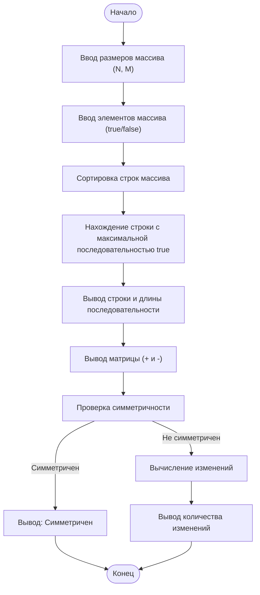

# Lab-2
## Отчет по лабораторной работе № 2

#### № группы: `ПМ-2402`

#### Выполнил: `Киблицкий Ян Денисович`

#### Вариант: `11`

### Cодержание:

- [Постановка задачи](#1-постановка-задачи)
- [Входные и выходные данные](#2-входные-и-выходные-данные)
- [Выбор структуры данных](#3-выбор-структуры-данных)
- [Алгоритм](#4-алгоритм)
- [Программа](#5-программа)
- [Анализ правильности решения](#6-анализ-правильности-решения)

### 1. Постановка задачи
## Задачи

1. Считать с консоли размеры массива N и M, а затем элементы массива размером N × M (значения true или false).
2. Сортировать строки массива по возрастанию количества значений `true` в каждой строке. При равенстве количества сортировать строки по количеству последовательных значений `true`.
3. Найти и вывести строку с максимальным количеством последовательных значений `true`, а также длину этой последовательности.
4. Вывести элементы массива в виде матрицы, заменяя `true` на символ `+` и `false` на символ `-`. Дополнительно подсчитать количество "островков" (групп соседних значений `true` в каждой строке).
5. Проверить симметричность массива относительно главной диагонали. Если массив несимметричен, определить минимальное количество изменений для достижения симметрии.

### 2. Входные и выходные данные

#### Данные на вход

На вход программа должна получать 2 числа, при этом в условии не сказано, к какому множеству
принадлежать получаемые числа, поэтому будем считать их вещественными положительными (тк это стороны матрицы, а проверка на некорректные значения не требуется). 
Также даны верхняя и нижняя границы получаемых чисел.

| Параметр      | Тип                | min значение    | max значение   |
|---------------|--------------------|-----------------|----------------|
| `M` (Число 1) | Вещественное число |        >0       | 10<sup>9</sup> |
| `N` (Число 2) | Вещественное число |        >0       | 10<sup>9</sup> |

Так же программа получает матрицу M x N типа boolean.

| Параметр        | Тип      |
|-----------------|----------|
| Элемент матрицы | Boolean  |


#### Данные на выход

1. Отсортированный массив
   
| Параметр            | Тип данных  |
|---------------------|-------------|
| Элементы массива    | boolean     |

2. Строка с максимальной последовательностью true
   
| Параметр                      | Тип данных     | Минимальное значение | Максимальное значение |
|-------------------------------|----------------|-----------------------|----------------------|
| Элемент строки                | boolean        | -                     | -                    |
| Длина последовательности      | int            | 0                     | M                    |

3. Матрица с заменой true/false на символы
   
| Параметр            | Тип данных | Минимальное значение | Максимальное значение |
|---------------------|------------|-----------------------|-----------------------|
| Символьная матрица  | char       | '-'                   | '+'                   |


4. Симметрия относительно главной диагонали
   
| Параметр                                       | Тип данных | Минимальное значение | Максимальное значение |
|------------------------------------------------|------------|----------------------|-----------------------|
| Симметрия массива                              | boolean    | -                    | -                     |
| Минимальное количество изменений для симметрии | int        | 0                    | (`N` × `M`)/2         |


### 3. Выбор структуры данных

Программа получает 2 вещественных числа, не превышающих по модулю 10<sup>9</sup> . Поэтому для их хранения
можно выделить 2 переменных (`M` и `N`) типа `int`.

|             | название переменной | Тип (в Java) | 
|-------------|---------------------|--------------|
| X (Число 1) | `M`                 | `int`        |
| Y (Число 2) | `N`                 | `int`        | 

Для вывода результата необязательно его хранить в отдельной переменной.

### 4. Алгоритм

#### Алгоритм выполнения программы:

### 1. **Ввод данных**

1. Программа запрашивает у пользователя размеры двумерного массива (N - количество строк, M - количество столбцов).
2. Программа инициализирует двумерный массив булевых значений размером N × M.
3. Программа запрашивает у пользователя ввод значений для каждого элемента массива, где каждый элемент должен быть либо `true`, либо `false`.

### 2. **Сортировка строк массива**

1. Программа сортирует строки двумерного массива:
   - Сначала строки сортируются по количеству значений `true` в каждой строке.
   - Если количество значений `true` в строках одинаково, строки сортируются по максимальной длине последовательных значений `true` в каждой строке.

### 3. **Нахождение строки с максимальной длиной последовательных `true`**

1. Программа перебирает строки массива и вычисляет для каждой строки длину максимальной последовательности `true`.
2. Программа запоминает строку с максимальной длиной последовательности `true` и выводит её вместе с длиной этой последовательности.

### 4. **Вывод матрицы**

1. Программа выводит матрицу, заменяя элементы `true` на символ `+`, а элементы `false` на символ `-`.

### 5. **Проверка симметрии массива относительно главной диагонали**

1. Программа проверяет, является ли массив симметричным относительно главной диагонали.
   - Если массив симметричен, то выводится сообщение о симметричности
   - Если массив не симметричен, то вычисляется и выводится минимальное количество изменений для достижения симметрии.

#### Блок-схема



### 5. Программа

```java
import java.util.Scanner;
public class Main {
    public static void main(String[] args) {
        Scanner scanner = new Scanner(System.in);

        // 1. Ввод данных
        // Запрашиваем размеры массива у пользователя
        System.out.println("Введите размеры массива (N M):");
        int n = scanner.nextInt(); // Количество строк
        int m = scanner.nextInt(); // Количество столбцов

        // Инициализируем двумерный массив boolean
        boolean[][] array = new boolean[n][m];

        // Пользователь вводит элементы массива (true/false)
        System.out.println("Введите элементы массива (true/false):");
        for (int i = 0; i < n; i++) {
            for (int j = 0; j < m; j++) {
                array[i][j] = scanner.nextBoolean();
            }
        }

        // 2. Сортировка строк массива по возрастанию количества true и по длине самой длинной последовательности true
        for (int i = 0; i < n - 1; i++) {
            for (int j = i + 1; j < n; j++) {
                int countTrueI = countTrue(array[i]);
                int countTrueJ = countTrue(array[j]);
                int maxTrueI = maxTrue(array[i]);
                int maxTrueJ = maxTrue(array[j]);

                // Сравниваем сначала по количеству true, затем по максимальной длине последовательности true
                if (countTrueI > countTrueJ || (countTrueI == countTrueJ && maxTrueI > maxTrueJ)) {
                    // Меняем местами строки
                    boolean[] b = array[i];
                    array[i] = array[j];
                    array[j] = b;
                }
            }
        }

        // 3. Нахождение строки с максимальным количеством последовательных true
        int maxIndex = 0; // Индекс строки с максимальной последовательностью
        int maxLength = 0; // Длина этой последовательности
        for (int i = 0; i < n; i++) {
            int length = maxTrue(array[i]);
            if (length > maxLength) {
                maxLength = length;
                maxIndex = i;
            }
        }

        // Выводим результат
        System.out.println("\nСтрока с максимальным количеством последовательных значений true:");
        System.out.println(printRow(array[maxIndex]) + " Длина: " + maxLength);

        // 4. Вывод матрицы с заменой true на '+' и false на '-'
        System.out.println("\nМатрица после сортировки:");
        printMatrix(array);

        // 5. Проверка симметричности относительно главной диагонали
        boolean isSymmetric = true;
        int minDim = Math.min(n, m);
        int changes = 0;

        // Проверяем симметрию для пересекающейся части матрицы
        for (int i = 0; i < minDim; i++) {
            for (int j = i + 1; j < minDim; j++) {
                if (array[i][j] != array[j][i]) {
                    isSymmetric = false;
                    changes++;
                }
            }
        }

        // Проверяем дополнительные элементы, если матрица не квадратная
        if (n > m) {
            for (int i = m; i < n; i++) {
                for (int j = 0; j < m; j++) {
                    if (array[i][j]) {
                        isSymmetric = false;
                        changes++;
                    }
                }
            }
        } else if (m > n) {
            for (int j = n; j < m; j++) {
                for (int i = 0; i < n; i++) {
                    if (array[i][j]) {
                        isSymmetric = false;
                        changes++;
                    }
                }
            }
        }

        // Вывод результатов проверки симметрии
        if (isSymmetric) {
            System.out.println("\nМассив симметричен относительно главной диагонали.");
        } else {
            System.out.println("\nМассив не симметричен относительно главной диагонали.");
            System.out.println("Минимальное количество изменений для симметрии: " + changes);
        }

        scanner.close();
    }

    // Подсчет количества значений true в строке
    private static int countTrue(boolean[] row) {
        int count = 0;
        for (boolean value : row) {
            if (value) count++;
        }
        return count;
    }

    // Нахождение максимальной длины последовательных значений true в строке
    private static int maxTrue(boolean[] row) {
        int max = 0;
        int current = 0;
        for (boolean value : row) {
            if (value) {
                current++; // Увеличиваем текущую последовательность
                if (current > max) {
                    max = current; // Обновляем максимум
                }
            } else {
                current = 0; // Сбрасываем последовательность
            }
        }
        return max;
    }

    // Вывод строки в виде символов '+' и '-'
    private static String printRow(boolean[] row) {
        String rowString = "";
        for (boolean value : row) {
            rowString += (value ? "+" : "-");
            rowString += " ";
        }
        return rowString.trim(); // Удаляем последний пробел
    }

    // Вывод массива с заменой true на '+' и false на '-'
    private static void printMatrix(boolean[][] array) {
        for (boolean[] row : array) {
            System.out.println(printRow(row));
        }
    }
}

```

### 6. Анализ правильности решения

Программа работает корректно на различных тестовых данных, учитывая все возможные случаи и ограничения.

### 6. Анализ правильности решения

Программа работает корректно на различных тестовых данных, учитывая все возможные случаи и ограничения.

1. **Тест на квадратную симметричную матрицу:**

    - **Input:**
        ```
        3 3
        true false true
        false true false
        true false true
        ```
    
    - **Output:**
        ```
        Строка с максимальным количеством последовательных значений true:
        + - + Длина: 1

        Матрица после сортировки:
        - + -
        + - +
        + - +

        Массив симметричен относительно главной диагонали.
        ```

2. **Тест на квадратную несимметричную матрицу:**

    - **Input:**
        ```
        3 3
        true false true
        false false false
        true true true
        ```
    
    - **Output:**
        ```
        Строка с максимальным количеством последовательных значений true:
        + + + Длина: 3

        Матрица после сортировки:
        - - -
        + - +
        + + +

        Массив несимметричен относительно главной диагонали.
        Минимальное количество изменений для симметрии: 2
        ```

3. **Тест на прямоугольную матрицу:**

    - **Input:**
        ```
        4 3
        true false true
        false true false
        true true false
        false false false
        ```
    
    - **Output:**
        ```
        Строка с максимальным количеством последовательных значений true:
        + + - Длина: 2

        Матрица после сортировки:
        - - -
        - + -
        + - +
        + + -

        Массив несимметричен относительно главной диагонали.
        Минимальное количество изменений для симметрии: 3
        ```

4. **Тест на матрицу с всеми значениями `false`:**

    - **Input:**
        ```
        2 2
        false false
        false false
        ```
    
    - **Output:**
        ```
        Строка с максимальным количеством последовательных значений true:
        - - Длина: 0

        Матрица после сортировки:
        - - 
        - - 

        Массив симметричен относительно главной диагонали.
        ```

5. **Тест на матрицу с всеми значениями `true`:**

    - **Input:**
        ```
        2 2
        true true
        true true
        ```
    
    - **Output:**
        ```
        Строка с максимальным количеством последовательных значений true:
        + + Длина: 2

        Матрица после сортировки:
        + + 
        + + 

        Массив симметричен относительно главной диагонали.
        ```

6. **Тест на матрицу с одной строкой:**

    - **Input:**
        ```
        1 5
        true true false true false
        ```
    
    - **Output:**
        ```
        Строка с максимальным количеством последовательных значений true:
        + + - + - Длина: 2

        Матрица после сортировки:
        + + - + -

        Минимальное количество изменений для симметрии: 2
        ```

7. **Тест на матрицу с одним столбцом:**

    - **Input:**
        ```
        5 1
        false
        false
        true
        true
        true
        ```
    
    - **Output:**
        ```
        Строка с максимальным количеством последовательных значений true:
        + Длина: 1

        Матрица после сортировки:
        -
        -
        +
        +
        +

        Массив не симметричен относительно главной диагонали.
        Минимальное количество изменений для симметрии: 3
        ```
